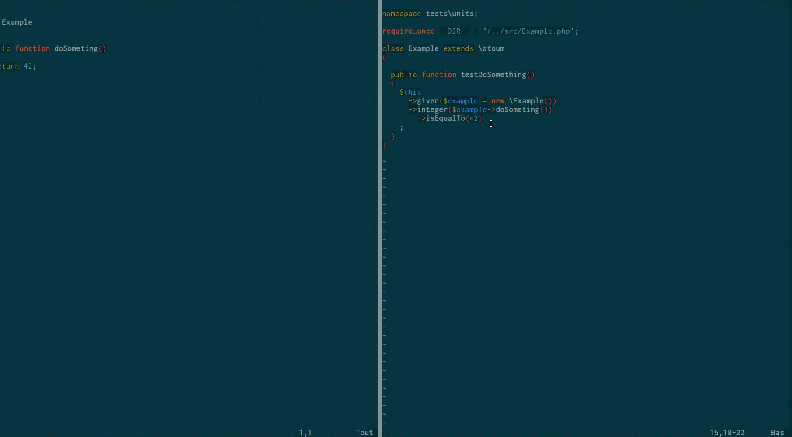

# atoum/autoloop-extension [](https://travis-ci.org/atoum/autoloop-extension)


autoloop-extension allows you automaticly run your tests in atoum's loop mode when files are changed.

## Example

Here is an example : we can see that the test files are automaticly executed when the classes and test classes are changed.


## Install it

Install extension using [composer](https://getcomposer.org):

```
composer require --dev atoum/autoloop-extension
```

Then, the only thing you have to do is to set the watched files like this:

```php

<?php
// .atoum.php

$runner
    ->getExtension(mageekguy\atoum\autoloop\extension::class)
        ->setWatchedFiles(array(__DIR__ . '/src'))
;
```

## Use it

When the extension is loaded a new option is available : 

```
--autoloop: Automaticly relaunch tests on file change (implies --loop)
```

So, instead of launch the loop mode like this (an having to press enter each time you want to run the tests) : 


```
./vendor/bin/atoum --loop
```

Just run the tests like this : 

```
./vendor/bin/atoum --autoloop
```

All your usual options are available. 

## Tips

### Notifications

This extension works well with with atoum's notification.

```php
//.atoum.php

$report = $script->addDefaultReport();

$notifier = new atoum\report\fields\runner\result\notifier\image\libnotify();

$notifier
    ->setSuccessImage(__DIR__ . '/vendor/atoum/atoum/resources/images/logo/success.png')
    ->setFailureImage(__DIR__ . '/vendor/atoum/atoum/resources/images/logo/failure.png')
;

$report
    ->addField($notifier)
;
```

With a setup like this, you will not even have to look at your console to see your test results. Here is what it looks like:




## Links

* [atoum](http://atoum.org)
* [atoum's documentation](http://docs.atoum.org)


## Licence

autoloop-extension is released under the MIT License. See the bundled LICENSE file for details.


